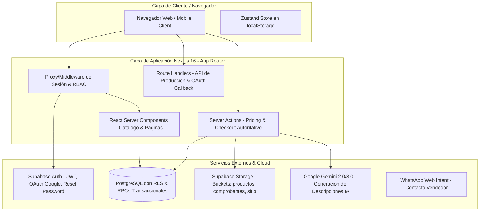
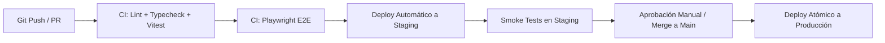

# PRODUCTION_READINESS_PLAN.md
## Plan de Preparación para Producción, Arquitectura Cloud y Despliegue de Staging
**Proyecto:** Milideas Page (Next.js 16 + React 19 + Supabase + PostgreSQL)
**Fecha:** 2026-08-25
**Rol:** Senior DevSecOps & Cloud Security Engineer
**Versión:** 1.0

---

## 1. Análisis de la Arquitectura Actual



### Componentes Actuales
- **Frontend / SSR:** Next.js 16.2.10 (App Router), React 19.2.4, TailwindCSS v4, Framer Motion.
- **Backend / Lógica:** Server Actions (`src/lib/actions/index.ts`) con recálculo autoritativo de precios y validación Zod.
- **Base de Datos & Auth:** PostgreSQL (Supabase) con Row Level Security (RLS) y RPCs transaccionales (`crear_pedido`, `confirmar_pago`, `cancelar_pedido`, `expirar_pedidos_vencidos`).
- **Almacenamiento de Archivos:** Supabase Storage (Buckets: `productos` público, `comprobantes` privado con policy de lectura restringida a admin).
- **Servicios de Inteligencia:** Google Gemini API para generación de descripciones desde el panel admin.
- **CI/CD:** GitHub Actions (`.github/workflows/ci.yml`) ejecutando Lint, Typecheck, Vitest, Build y Playwright E2E.

---

## 2. Proveedor de Hosting y Arquitectura Propuesta para Staging y Producción

### 2.1 Comparativa y Selección de Hosting

| Criterio | Vercel (Recomendado) | AWS (Amplify / ECS Fargate) | VPS / Coolify / Docker |
|---|:---:|:---:|:---:|
| **Compatibilidad Next.js 16 (App Router + Server Actions)** | 🟢 Nativa (100%) | 🟡 Parcial / demoras en parches | 🟡 Requiere gestión de Node.js + Standalone |
| **Despliegues Automáticos de Staging (Preview Deployments)** | 🟢 Automático por PR y rama | 🟡 Complejo de orquestar | 🔴 Manual |
| **Seguridad de Edge & DDoS / WAF** | 🟢 Cloudflare/Edge integrado | 🟢 AWS Shield / WAF (costoso) | 🔴 Requiere Cloudflare externo manual |
| **Gestión de Secretos & Variables por Ambiente** | 🟢 Integrado (Dev/Preview/Prod) | 🟢 Secrets Manager / SSM | 🟡 Archivos `.env` en servidor |
| **Certificados SSL/TLS & HSTS Automáticos** | 🟢 Automático (Let's Encrypt / ZeroSSL) | 🟢 ACM | 🟡 Certbot manual |
| **Costo para etapa inicial** | 🟢 Free / Pro ($20/mes) | 🔴 Alto por servicios base | 🟢 Bajo pero alto en mantenimiento |

> **Recomendación Técnica:** **Vercel Pro + Supabase Managed Cloud (Pro Tier)**.
> Es la combinación con menor fricción operativa, soporte oficial de Server Actions en streaming, preview deployments aislados para Staging y certificados automáticos con HSTS.

---

## 3. Separación Estricta de Ambientes (Development vs Staging vs Production)

```text
┌──────────────────────────────┐     ┌──────────────────────────────┐     ┌──────────────────────────────┐
│         DEVELOPMENT          │     │           STAGING            │     │          PRODUCTION          │
├──────────────────────────────┤     ├──────────────────────────────┤     ├──────────────────────────────┤
│ • URL: localhost:3000        │     │ • URL: staging.milideas.com  │     │ • URL: milideas.com          │
│ • DB: Supabase Local / Dev   │     │ • DB: Supabase Staging Proj  │     │ • DB: Supabase Prod Project  │
│ • Storage: Local/Dev Buckets │     │ • Storage: Staging Buckets   │     │ • Storage: Prod Buckets      │
│ • Secretos de prueba         │     │ • Secretos de Staging        │     │ • Secretos Reales Cifrados   │
│ • Datos Dummy (seed.sql)     │     │ • Datos de prueba sintéticos │     │ • Datos reales de clientes   │
└──────────────────────────────┘     └──────────────────────────────┘     └──────────────────────────────┘
```

### Reglas Inviolables de Aislamiento:
1. **Bases de datos independientes:** Staging y Producción **nunca** deben compartir la misma instancia de base de datos de Supabase ni las mismas credenciales.
2. **Sin datos de clientes en Staging:** La base de datos de Staging se inicializa exclusivamente con datos sintéticos vía `seed.sql`.
3. **Claves de servicio aisladas:** `SUPABASE_SECRET_KEY` de producción jamás debe ingresarse en variables de staging o de CI.
4. **Google OAuth Client IDs separados:** Staging debe usar un OAuth Client ID con origen `https://staging.milideas.com`, mientras producción usa `https://milideas.com`.

---

## 4. Auditoría de Variables de Entorno y Secretos

### 4.1 Clasificación de Variables

| Variable | Alcance | Crítica | Propósito | Regla de Seguridad |
|---|:---:|:---:|---|---|
| `NEXT_PUBLIC_SUPABASE_URL` | Público (Navegador/Servidor) | Media | Endpoint de Supabase | Permitido en cliente. Solo HTTPS. |
| `NEXT_PUBLIC_SUPABASE_ANON_KEY` | Público (Navegador/Servidor) | Media | Clave anónima pública de Supabase | Sujeta a RLS en base de datos. |
| `NEXT_PUBLIC_APP_URL` | Público (Navegador/Servidor) | Media | URL base del sitio (`https://...`) | Usado en sitemap, robots y metadata. |
| `NEXT_PUBLIC_VENDOR_WHATSAPP` | Público (Navegador/Servidor) | Baja | Número de WhatsApp de contacto | Público para checkout. |
| `NEXT_PUBLIC_BANK_ACCOUNT_INFO` | Público (Navegador/Servidor) | Baja | CBU/Alias para transferencias | Público en pantalla de éxito. |
| `SUPABASE_SECRET_KEY` | **Privado (Solo Servidor)** | 🔴 **CRÍTICA** | Clave Service Role (Bypassea RLS) | **NUNCA PREFIJO NEXT_PUBLIC**. Solo en server runtime. |
| `ADMIN_SETUP_SECRET` | **Privado (Solo Servidor)** | 🔴 **CRÍTICA** | Secreto para `makeMeAdminAction` | Token aleatorio de 64 caracteres hex. |
| `GEMINI_API_KEY` | **Privado (Solo Servidor)** | 🔴 **CRÍTICA** | Token API de Google Generative AI | Restringido en Google Cloud Console. |
| `GOOGLE_CLIENT_SECRET` | **Privado (Solo Servidor)** | 🔴 **CRÍTICA** | Secreto de Google OAuth | Configurado en Supabase Dashboard. |

---

## 5. Endurecimiento de Configuración (`next.config.ts`, Headers, CORS, CSP)

### 5.1 Corrección Crítica en `serverActions.allowedOrigins`
Actualmente, `next.config.ts` tiene hardcodeadas IPs locales (`192.168.1.110`, `localhost`).
**Riesgo:** En Staging o Producción, las Server Actions serían rechazadas con error de origen no autorizado.
**Solución:** Dinamizar `allowedOrigins` basándose en el hostname de `NEXT_PUBLIC_APP_URL`, `process.env.VERCEL_URL` y dominios de producción.

### 5.2 Política Content-Security-Policy (CSP)
Se implementa una cabecera CSP balanceada que permita:
- `default-src 'self'`
- `script-src 'self' 'unsafe-eval' 'unsafe-inline'` (necesario para Next.js runtime y Framer Motion)
- `style-src 'self' 'unsafe-inline' https://fonts.googleapis.com`
- `font-src 'self' https://fonts.gstatic.com data:`
- `img-src 'self' data: blob: https://*.supabase.co https://placehold.co`
- `connect-src 'self' https://*.supabase.co wss://*.supabase.co https://generativelanguage.googleapis.com`
- `frame-ancestors 'none'` (anti-clickjacking)

---

## 6. Base de Datos, Backups y Plan de Recuperación ante Desastres (DRP)

### 6.1 Backups Automatizados
- **Point-in-Time Recovery (PITR):** Habilitar PITR en Supabase Pro (permite restaurar a cualquier segundo dentro de los últimos 7 días).
- **Daily Logical Backups:** Snapshot diario exportado vía `pg_dump` y almacenado cifrado con AES-256 en un bucket S3 de retención secundaria.

### 6.2 Procedimiento de Restauración y Rollback de Base de Datos
1. **Detección de Incidente:** Corrupción de datos o migración defectuosa.
2. **Point-in-Time Restore:** Desde el dashboard de Supabase -> `Settings` -> `Database` -> `Backups` -> `Restore to Point in Time`.
3. **Verificación de Integridad:** Ejecutar query de verificación de tablas `pedidos`, `productos`, `perfiles` antes de reactivar el tráfico.
4. **Tiempo Estimado de Recuperación (RTO):** < 15 minutos. **Pérdida Máxima de Datos (RPO):** < 1 minuto.

---

## 7. Rate Limiting y Protección contra Abuso

### 7.1 Vectores Sensibles Identificados
1. `/login` y `/registro` (Ataques de fuerza bruta y credential stuffing).
2. `/recuperar` (Abuso de cuota de emails transaccionales de Supabase Auth).
3. `generarDescripcionProductoIAAction` (Consumo no autorizado de tokens de Gemini API).
4. `subirComprobanteAction` (Denegación de servicio por almacenamiento masivo).

### 7.2 Estrategia de Mitigación
- **Supabase Auth Built-in Rate Limits:** Ya configurados a nivel de plataforma (1 email por minuto por IP/usuario para recovery).
- **App-level Validation:** Whitelists de tamaño y tipo de archivo validados server-side en < 50ms.
- **Edge Rate Limiting (Cloudflare / Vercel Edge Middleware):** Regla de 60 requests/min por IP en endpoints de mutación POST.

---

## 8. Pipeline de CI/CD Seguro y Rollback de Aplicación



### Procedimiento de Rollback Inmediato:
- **Vercel Instant Rollback:** En caso de error en producción, revertir al deployment previo instantáneamente con 1 clic en Vercel Dashboard (`Instant Rollback`) o vía CLI `vercel rollback`. Tiempo de conmutación: **< 5 segundos**, sin tiempo de inactividad.

---

## 9. Matriz de Prioridad de Acciones Previas al Despliegue

| ID | Nivel | Acción Requerida | Estado |
|---|:---:|---|:---:|
| **PR-01** | 🔴 **CRITICAL** | Dinamizar `allowedOrigins` en `next.config.ts` para soportar dominios de Staging y Producción | **PENDIENTE** |
| **PR-02** | 🔴 **CRITICAL** | Completar `.env.example` con todas las variables privadas (`SUPABASE_SECRET_KEY`, `ADMIN_SETUP_SECRET`, `GEMINI_API_KEY`) | **PENDIENTE** |
| **PR-03** | 🔴 **CRITICAL** | Ejecutar migración de bucket privado `comprobantes` en la base de datos de Staging/Prod | **LISTO (SQL generado)** |
| **PR-04** | 🟠 **HIGH** | Configurar Content-Security-Policy (CSP) en cabeceras HTTP de Next.js | **PENDIENTE** |
| **PR-05** | 🟠 **HIGH** | Configurar proyecto independiente de Supabase para Staging con `seed.sql` | **GUÍA DOCUMENTADA** |
| **PR-06** | 🟡 **MEDIUM** | Actualizar GitHub Actions CI para ejecutar toda la suite de 35 tests automáticamente | **PENDIENTE** |
| **PR-07** | 🟢 **LOW** | Configurar monitoreo de errores en tiempo real (Sentry / Vercel Analytics) | **RECOMENDADO** |
