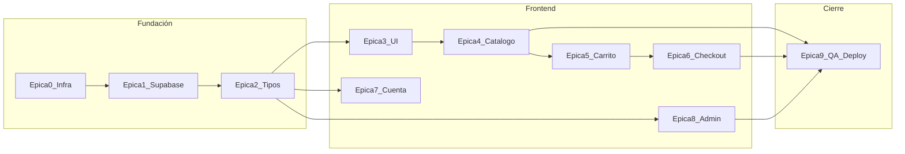
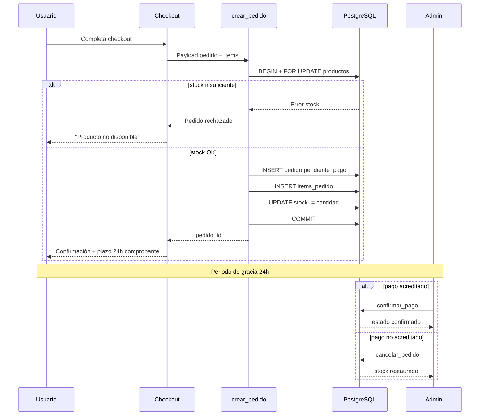
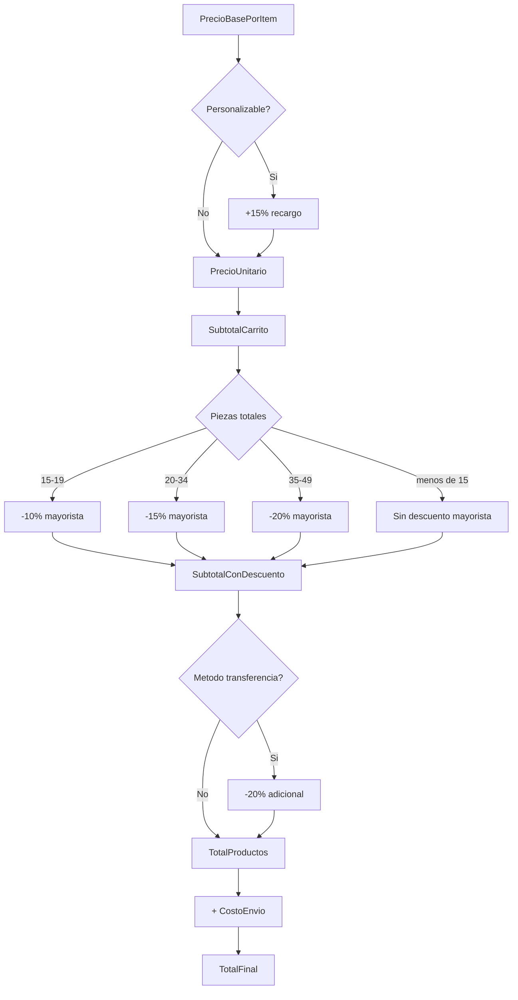

# Roadmap de Desarrollo — Milideas E-commerce

## Contexto y supuestos del plan

El repositorio está **greenfield** (solo existe [`milideas-context.md`](milideas-context.md)). Decisiones arquitectónicas **cerradas**:

- **Modelo Drops (MVP)**: campos `fecha_lanzamiento` (TIMESTAMP) y `activo` (BOOLEAN) directamente en `productos`. Sin tabla `drops` dedicada en MVP.
- **Reserva de stock**: decremento atómico en checkout vía RPC `crear_pedido`. Estado inicial del pedido: `pendiente_pago`. Periodo de gracia de 24 h para subir comprobante. Cancelación admin devuelve stock automáticamente vía RPC `cancelar_pedido`.
- **Pedidos invitados**: creación **exclusivamente vía RPC** `crear_pedido`. Sin INSERT público directo en `pedidos` ni `items_pedido`.
- **Estado del carrito**: Zustand como store principal.
- **Pagos MVP**: transferencia bancaria (descuento -20%) + comprobante vía Supabase Storage. Enum `metodo_pago` extensible para métodos futuros (MercadoPago, etc.).
- **Checkout invitado**: soportado por `pedidos.usuario_id` nullable.
- **Ejecución**: cada tarea se implementa, revisa y valida antes de pasar a la siguiente dentro de la misma épica.



---

## Épica 0 — Infraestructura base y arquitectura del proyecto

**Objetivo**: Tener un proyecto Next.js listo para producción, con convenciones claras de carpetas, tipado estricto y SEO habilitado desde el día 1.

| # | Tarea | Entregable |
|---|-------|------------|
| 0.1 | Inicializar proyecto Next.js (App Router) con TypeScript | Proyecto base ejecutable |
| 0.2 | Activar `strict: true` y reglas TS adicionales (`noUncheckedIndexedAccess`, paths alias `@/`) | [`tsconfig.json`](tsconfig.json) endurecido |
| 0.3 | Configurar Tailwind CSS con tokens Ghost UI (paleta neutra, tipografía, spacing mobile-first) | [`tailwind.config.ts`](tailwind.config.ts), [`globals.css`](src/app/globals.css) |
| 0.4 | Definir estructura de carpetas acordada | Ver árbol propuesto abajo |
| 0.5 | Configurar ESLint + Prettier alineados a Next.js/TS | Archivos de lint/format |
| 0.6 | Crear plantilla de variables de entorno (`.env.example`) | Claves Supabase, URL pública, etc. |
| 0.7 | Configurar [`next.config.ts`](next.config.ts): dominios de imágenes Supabase, headers básicos de seguridad | Config lista para `next/image` |
| 0.8 | Implementar layout raíz con metadata base, `lang="es"`, fuentes optimizadas | [`src/app/layout.tsx`](src/app/layout.tsx) |
| 0.9 | Añadir utilidades base: `cn()` (clsx + tailwind-merge), constantes de app | [`src/lib/utils/`](src/lib/utils/) |

**Estructura de carpetas propuesta**:

```
src/
├── app/                    # Rutas App Router (páginas, layouts, loading, error)
│   ├── (storefront)/       # Catálogo, producto, carrito, checkout
│   ├── (auth)/             # login, registro, recuperación
│   └── admin/              # Panel administrativo
├── components/
│   ├── ui/                 # Primitivos reutilizables
│   ├── product/            # Cards, galería, badges
│   ├── cart/               # Drawer, líneas de carrito
│   └── layout/             # Header, Footer, Nav mobile
├── lib/
│   ├── supabase/           # Clientes server/browser/middleware
│   ├── pricing/            # Motor de descuentos y recargos
│   ├── shipping/           # Cálculo de envíos por zona
│   └── validations/        # Schemas Zod
├── stores/                 # Zustand (carrito)
├── types/                  # Tipos de dominio + re-exports Supabase
└── hooks/                  # Hooks compartidos
supabase/
├── migrations/             # SQL versionado
└── seed.sql                # Datos de prueba (opcional)
```

---

## Épica 1 — Supabase: esquema, Auth, RLS y clientes

**Objetivo**: Base de datos segura, clientes SSR-compatible y flujo de identidad completo.

### 1A — Esquema y migraciones

| # | Tarea | Detalle |
|---|-------|---------|
| 1.1 | Inicializar Supabase CLI local (`supabase init`) | Proyecto linkeado a instancia remota |
| 1.2 | Migración: tabla `perfiles` + trigger `on_auth_user_created` | Sincroniza `auth.users` → `perfiles` |
| 1.3 | Migración: `categorias`, `productos`, `producto_imagenes` | FKs, `slug` UNIQUE, CHECK constraints de precio/stock. En `productos`: `fecha_lanzamiento` (TIMESTAMP), `activo` (BOOLEAN DEFAULT true) |
| 1.4 | Índice Drops en `productos` | Índice compuesto `(activo, fecha_lanzamiento DESC)` para consultas de lanzamientos |
| 1.5 | Migración: `pedidos`, `items_pedido` | Enum `estado_pedido`: `pendiente_pago`, `confirmado`, `enviado`, `cancelado`. Campo `fecha_limite_pago` (TIMESTAMP, default now() + 24h). Enum `metodo_pago` extensible |
| 1.6 | Migración: `configuracion_logistica` | Zonas con precios agencia/domicilio |
| 1.7 | Índices de performance | `productos(slug)`, `productos(categoria_id)`, `pedidos(usuario_id)`, `items_pedido(pedido_id)` |
| 1.8 | Seed inicial | Categorías, 2-3 productos demo, 1 zona logística |

### 1B — Row Level Security (RLS)

| # | Tarea | Política |
|---|-------|----------|
| 1.9 | Habilitar RLS en **todas** las tablas públicas | Obligatorio por seguridad Supabase |
| 1.10 | `perfiles`: SELECT/UPDATE propio; admin SELECT all | Basado en `perfiles.es_admin` vía subquery segura (no `user_metadata`) |
| 1.11 | `categorias`, `productos`, `producto_imagenes`: SELECT público; INSERT/UPDATE/DELETE solo admin | Escritura catálogo exclusiva admin |
| 1.12 | `pedidos`: **sin INSERT/UPDATE público**. SELECT propio (autenticado) o admin. Escritura solo vía RPC `crear_pedido` / `cancelar_pedido` | Embudo seguro; invitados y autenticados usan el mismo RPC |
| 1.13 | `items_pedido`: **sin INSERT público**. SELECT acoplado al pedido padre. Escritura solo vía RPC | Consistencia transaccional garantizada |
| 1.14 | `configuracion_logistica`: SELECT público (zonas activas); escritura admin | |
| 1.15 | Auditar políticas con advisors de Supabase | Corregir gaps (UPDATE requiere SELECT, etc.) |

### 1C — Auth y Storage

| # | Tarea | Detalle |
|---|-------|---------|
| 1.16 | Configurar Supabase Auth (email/password MVP) | Redirect URLs para local y producción |
| 1.17 | Implementar clientes Supabase SSR | [`src/lib/supabase/server.ts`](src/lib/supabase/server.ts), [`client.ts`](src/lib/supabase/client.ts), [`middleware.ts`](src/lib/supabase/middleware.ts) |
| 1.18 | Middleware Next.js para refresco de sesión | Proteger rutas `/admin/*` y `/cuenta/*` |
| 1.19 | Bucket Storage `comprobantes` | Política: upload autenticado/invitado con path acotado; lectura admin |
| 1.20 | Bucket Storage `productos` | Upload admin; lectura pública para URLs de catálogo |

### 1D — RPCs transaccionales (obligatorio)

| # | Tarea | Detalle |
|---|-------|---------|
| 1.21 | RPC `crear_pedido` (SECURITY DEFINER en schema privado) | Transacción atómica con `SELECT ... FOR UPDATE` sobre productos: (1) verificar `stock_disponible > 0` por item, (2) crear pedido en estado `pendiente_pago` con `fecha_limite_pago = now() + interval '24 hours'`, (3) insertar `items_pedido`, (4) decrementar stock. Rollback completo si cualquier item falla (evita overselling en drops) |
| 1.22 | RPC `cancelar_pedido` (solo admin) | Transacción atómica: cambiar estado a `cancelado` + restaurar `stock_disponible` de cada item. Idempotente si ya está cancelado |
| 1.23 | RPC `confirmar_pago` (admin) | Cambiar `pendiente_pago` → `confirmado` tras verificar comprobante. **No modifica stock** (ya reservado en checkout) |
| 1.24 | Constraint anti-stock-negativo | CHECK `stock_disponible >= 0` en `productos` como red de seguridad |

**Flujo de reserva de stock**:



---

## Épica 2 — Tipos TypeScript, validaciones y lógica de dominio

**Objetivo**: Tipado estricto de punta a punta y reglas de negocio centralizadas (testeables).

| # | Tarea | Entregable |
|---|-------|------------|
| 2.1 | Generar tipos DB con Supabase CLI (`gen types typescript`) | [`src/types/database.types.ts`](src/types/database.types.ts) |
| 2.2 | Definir tipos de dominio derivados | `Producto`, `ProductoConImagenes`, `Pedido`, `LineaCarrito`, `ZonaLogistica` |
| 2.3 | Enums TS para estados | `EstadoPedido`, `TipoEnvio`, `MetodoPago` |
| 2.4 | Schemas Zod para formularios | Checkout, registro, admin producto |
| 2.5 | **Motor de pricing** [`src/lib/pricing/`](src/lib/pricing/) | Funciones puras: |
| | | - Recargo personalización +15% |
| | | - Descuentos mayoristas por cantidad total de piezas (10%/15%/20%) |
| | | - Descuento transferencia -20% sobre total |
| | | - Orden de aplicación documentado (subtotal → mayorista → transferencia) |
| 2.6 | **Motor de shipping** [`src/lib/shipping/`](src/lib/shipping/) | Precio según zona + tipo (agencia/domicilio) |
| 2.7 | Helper `getStockStatus()` | `disponible` (stock > 0) / `bajo_pedido` (stock = 0 y nunca tuvo reserva activa) / `no_disponible` (stock = 0 por reserva en pedido pendiente). El catálogo oculta o deshabilita compra en `no_disponible` |
| 2.8 | Tests unitarios de pricing y shipping | Vitest o Jest (solo lógica pura) |
| 2.9 | Queries tipadas reutilizables | [`src/lib/supabase/queries/`](src/lib/supabase/queries/) (productos, categorías, zonas) |

**Regla de negocio — orden de cálculo propuesto**:



---

## Épica 3 — Sistema de diseño y componentes UI base

**Objetivo**: Biblioteca de componentes Ghost UI, mobile-first, accesibles y tipados.

| # | Tarea | Componente |
|---|-------|------------|
| 3.1 | Tokens de diseño en Tailwind | Colores neutros, bordes sutiles, sombras mínimas |
| 3.2 | `Button`, `Input`, `Label`, `Textarea`, `Select` | Variantes: primary, ghost, outline |
| 3.3 | `Badge` | Estados: "Bajo pedido", "Entrega inmediata", "Personalizable" |
| 3.4 | `Card`, `Skeleton`, `Spinner` | Loading states |
| 3.5 | `Modal` / `Drawer` | Carrito y confirmaciones en mobile |
| 3.6 | `Toast` / feedback de acciones | Éxito/error en formularios |
| 3.7 | Layout: `Header`, `Footer`, `MobileNav` | Navegación sticky minimalista |
| 3.8 | `OptimizedImage` wrapper | Abstracción sobre `next/image` con sizes responsive |
| 3.9 | Documentación interna mínima | Storybook opcional; al menos README de componentes |

**Principios Ghost UI**: fondos crudos/blancos, tipografía como jerarquía principal, sin color decorativo salvo imágenes de producto y estados semánticos discretos.

---

## Épica 4 — Vistas storefront: SEO, catálogo y producto

**Objetivo**: Experiencia de compra pública optimizada para SEO y mobile.

| # | Tarea | Ruta / detalle |
|---|-------|----------------|
| 4.1 | Página Home | Hero minimalista + drop activo + CTA catálogo |
| 4.2 | Metadata dinámica por página | `generateMetadata()` en layout y páginas clave |
| 4.3 | `sitemap.ts` y `robots.ts` | URLs de productos y categorías |
| 4.4 | Listado catálogo `/catalogo` | Grid mobile-first, filtros por categoría |
| 4.5 | Vista Drops `/drops` | Filtro: `activo = true` AND `fecha_lanzamiento` dentro del drop vigente, ordenado por fecha DESC |
| 4.6 | Detalle producto `/producto/[slug]` | SSG/ISR con `generateStaticParams` + revalidación |
| 4.7 | Galería de imágenes ordenadas | Swipe en mobile, lazy load |
| 4.8 | Selector personalización | Toggle que recalcula precio en tiempo real (pricing engine) |
| 4.9 | Indicadores de stock | Badge "Bajo pedido" cuando `stock_disponible = 0` |
| 4.10 | JSON-LD Product schema | Rich snippets para SEO |
| 4.11 | Páginas `loading.tsx` y `error.tsx` | UX de carga coherente |
| 4.12 | Open Graph images | Por producto (primera imagen) |

---

## Épica 5 — Carrito de compras (Zustand)

**Objetivo**: Estado persistente del carrito con sincronización de precios según reglas de negocio.

| # | Tarea | Detalle |
|---|-------|---------|
| 5.1 | Store Zustand [`src/stores/cart-store.ts`](src/stores/cart-store.ts) | Items: productoId, cantidad, personalizado, precio snapshot |
| 5.2 | Persistencia localStorage | Hidratación segura en cliente |
| 5.3 | Acciones: add, remove, updateQty, togglePersonalizacion | Validación de stock mínimo |
| 5.4 | Selectores derivados | subtotal, totalPiezas, descuentoMayorista, total |
| 5.5 | UI: icono carrito en header + badge cantidad | |
| 5.6 | UI: drawer/página carrito | Lista editable, resumen de descuentos desglosado |
| 5.7 | Empty state y CTA "Seguir comprando" | |

---

## Épica 6 — Checkout y creación de pedidos

**Objetivo**: Flujo completo de compra (invitado y autenticado) con envíos y transferencia.

| # | Tarea | Detalle |
|---|-------|---------|
| 6.1 | Ruta `/checkout` (multi-step o single page mobile) | Pasos: datos → envío → pago → confirmación |
| 6.2 | Formulario datos contacto | Nombre, WhatsApp (campo clave del negocio), email opcional |
| 6.3 | Selector zona logística | Fetch `configuracion_logistica` activas |
| 6.4 | Selector tipo envío | Agencia vs domicilio con precio dinámico |
| 6.5 | Resumen de pedido en checkout | Desglose: subtotal, descuentos, envío, total |
| 6.6 | Selector método de pago | Transferencia (-20%) como MVP |
| 6.7 | Upload comprobante (post-confirmación o inline) | Supabase Storage |
| 6.8 | Server Action que invoca RPC `crear_pedido` | Único punto de creación de pedidos (invitado y autenticado). Captura error de stock insuficiente del RPC |
| 6.9 | Página confirmación `/checkout/exito/[id]` | Resumen + instrucciones transferencia + countdown/plazo 24h (`fecha_limite_pago`) |
| 6.10 | Manejo errores de stock/concurrencia | Mensaje UX: "Esta pieza acaba de ser reservada por otro comprador". Revalidar carrito y redirigir |
| 6.11 | Protección CSRF en Server Actions | Patrón Next.js recomendado |

---

## Épica 7 — Cuenta de usuario

**Objetivo**: Autenticación y área privada del comprador.

| # | Tarea | Ruta |
|---|-------|------|
| 7.1 | Login `/login` | Email + password |
| 7.2 | Registro `/registro` | Crea perfil con nombre y WhatsApp |
| 7.3 | Recuperación contraseña | Flujo Supabase Auth |
| 7.4 | Perfil `/cuenta/perfil` | Editar nombre, WhatsApp |
| 7.5 | Historial pedidos `/cuenta/pedidos` | Lista con estados |
| 7.6 | Detalle pedido `/cuenta/pedidos/[id]` | Items, totales, comprobante |
| 7.7 | Vincular carrito anónimo al login | Merge al autenticarse |

---

## Épica 8 — Panel administrativo

**Objetivo**: Gestión del catálogo, pedidos y logística (solo `es_admin = true`).

| # | Tarea | Ruta / detalle |
|---|-------|----------------|
| 8.1 | Layout admin con guard de rol | Redirect si no es admin |
| 8.2 | Dashboard `/admin` | Métricas básicas: pedidos pendientes, stock bajo |
| 8.3 | CRUD categorías | Listado + formulario |
| 8.4 | CRUD productos | Campos completos del esquema + slug auto |
| 8.5 | Gestión imágenes producto | Upload a Storage, orden drag-and-drop |
| 8.6 | Gestión Drops | Toggle `activo` + asignar `fecha_lanzamiento` en formulario de producto |
| 8.7 | Listado pedidos `/admin/pedidos` | Filtros por estado; destacar `pendiente_pago` próximos a vencer (menos de 24 h restantes) |
| 8.8 | Detalle pedido admin | Acciones: `confirmar_pago` (→ confirmado), `cancelar_pedido` (→ cancelado + stock restaurado), ver comprobante |
| 8.9 | CRUD zonas logísticas | Precios agencia/domicilio, activar/desactivar |
| 8.10 | Validación server-side en todas las mutaciones | Doble capa: RLS + validación en Server Actions |

---

## Épica 9 — Integración final, QA, rendimiento y despliegue

**Objetivo**: Producto estable, seguro y desplegable.

| # | Tarea | Criterio de done |
|---|-------|------------------|
| 9.1 | Auditoría RLS y Storage | Sin políticas permisivas por defecto |
| 9.2 | Lighthouse mobile (Home, Producto, Checkout) | Performance > 90, SEO > 95 |
| 9.3 | Revisión accesibilidad básica | Focus, labels, contraste |
| 9.4 | Pruebas E2E críticas (Playwright) | Flujo: catálogo → carrito → checkout. Test de concurrencia: 2 checkouts simultáneos sobre pieza única → solo 1 exitoso |
| 9.5 | Configurar CI (lint + typecheck + tests) | GitHub Actions o similar |
| 9.6 | Despliegue Vercel + variables entorno | Preview y production |
| 9.7 | Dominio custom + SSL | |
| 9.8 | Monitoreo errores (Sentry opcional) | |
| 9.9 | Documentación de operación | Cómo crear drops, gestionar pedidos |

---

## Orden de ejecución recomendado (sprints)

| Sprint | Épicas | Resultado visible |
|--------|--------|-------------------|
| **Sprint 1** | 0 + 1A + 1B | Proyecto + BD migrada y segura |
| **Sprint 2** | 1C + 1D + 2 | Auth funcional + pricing testeado |
| **Sprint 3** | 3 + 4 | Catálogo navegable con SEO |
| **Sprint 4** | 5 + 6 | Compra end-to-end (transferencia) |
| **Sprint 5** | 7 + 8 | Cuenta usuario + admin operativo |
| **Sprint 6** | 9 | Producción |

---

## Criterios de aceptación globales

- TypeScript sin `any` implícitos; tipos DB sincronizados con migraciones.
- RLS habilitado en todas las tablas; admin verificado vía `perfiles.es_admin`.
- Todas las imágenes de producto vía `next/image` con `sizes` correctos.
- Reglas de descuento/envío/personalización implementadas **una sola vez** en `lib/pricing` y `lib/shipping`, consumidas por carrito y checkout.
- Reserva de stock atómica en `crear_pedido`; restauración automática en `cancelar_pedido`. Sin overselling en lanzamientos.
- Pedidos creados solo vía RPC; tablas `pedidos` e `items_pedido` sin INSERT público.
- Mobile-first verificado en viewport 375px antes de desktop.
- Cada épica cierra con una demo funcional antes de avanzar.

---

## Decisiones arquitectónicas cerradas

| Decisión | Veredicto |
|----------|-----------|
| **Drops MVP** | Campos `fecha_lanzamiento` + `activo` en `productos`. Índice compuesto para consultas. |
| **Pedidos invitados** | Exclusivamente vía RPC `crear_pedido`. Sin INSERT público en tablas de pedidos. |
| **Reserva de stock** | Decremento atómico al crear pedido (`pendiente_pago`). Periodo de gracia 24 h. Cancelación admin restaura stock. Confirmación de pago no toca stock. |
| **Métodos de pago** | Enum extensible. MVP: transferencia. Extensible a MercadoPago u otros sin refactor. |

**Mejora futura (post-MVP)**: job programado (`pg_cron`) para auto-cancelar pedidos `pendiente_pago` vencidos sin comprobante, invocando `cancelar_pedido` y notificando al admin.
